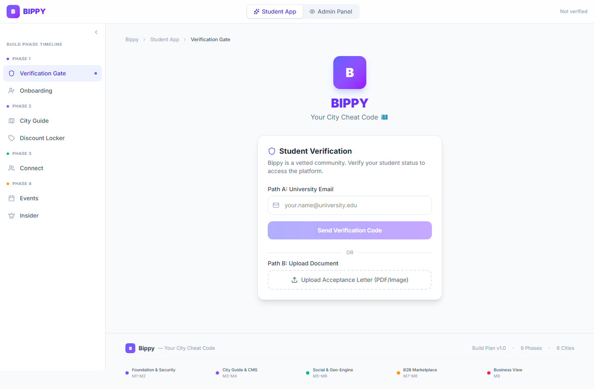
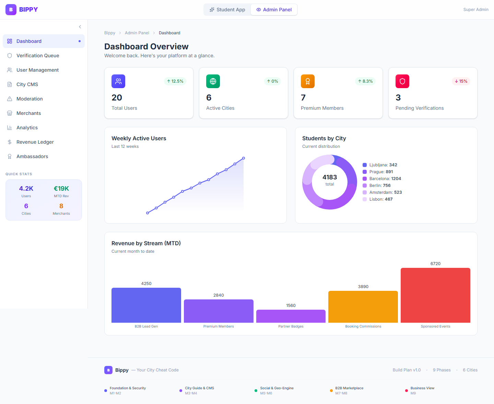

# Bippy

**Live:** https://bippy-product-development-roadmap.vercel.app

The name **Bippy** comes from the **BIP** (Blended Intensive Programme) Erasmus+ — a 1-week programme where students came to Slovenia. This app is the MVP built by the team during that week.

Our vision is a full platform that helps students find businesses to spend their money at and have a great time. The **B2B side** focuses on finding partners and generating cashflow — in exchange for guaranteeing foot traffic, we advertise businesses to warm leads (students).

Built as a product development roadmap app during the BIP Erasmus hackathon.

## Screenshots

| Student App | Admin Panel |
|---|---|
|  |  |
